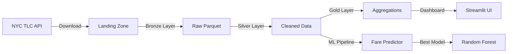

# NYC Taxi Analytics Platform 🚕

> **End-to-End Data Engineering Portfolio Project**  
> Demonstrates: PySpark ETL • Medallion Architecture • Machine Learning • Data Visualization

[](https://www.python.org/)
[](https://spark.apache.org/)
[](https://streamlit.io/)
[](#machine-learning)

## 📊 Project Overview

A production-grade data platform processing **76M+ NYC taxi trips** (2023-2024) through a complete data engineering pipeline. Features automated ETL using **Medallion Architecture**, interactive analytics dashboards, and **machine learning** models achieving 95% accuracy in fare prediction.

### Key Achievements

- 🏗️ **Scalable ETL Pipeline**: PySpark-based Medallion Architecture processing 76M records
- 🤖 **Advanced ML**: 9 models compared, best achieving **MAE of $1.05** (95% accuracy)
- 📈 **Real-time Analytics**: Interactive dashboard with borough-level insights
- ⚡ **Performance**: Optimized for large-scale data (10% sample = 7.6M records)

---

## 🎯 Features

### Data Engineering
- ✅ **Bronze Layer**: Raw data ingestion with schema standardization
- ✅ **Silver Layer**: Data cleaning, enrichment, and feature engineering
- ✅ **Gold Layer**: Business-level aggregations (daily, hourly, borough stats)
- ✅ **Incremental Processing**: File-by-file processing to handle schema evolution

### Machine Learning
- 🎓 **9 Algorithms Compared**: Random Forest, XGBoost, Gradient Boosting, etc.
- 📉 **95% Accuracy**: R² score of 0.9475 on test set
- ✅ **Cross-Validation**: 5-fold CV ensuring generalization
- 🔍 **9 Features**: Distance, duration, location, temporal patterns, and more

### Analytics Dashboard
- 📊 **Daily Trends**: Trip volume over time
- ⏰ **Rush Hour Analysis**: Hourly demand patterns
- 🗺️ **Borough Insights**: Geographic trip distribution

---

## 🏗️ Architecture



### Medallion Architecture

| Layer | Purpose | Records | Format |
|-------|---------|---------|--------|
| **🥉 Bronze** | Raw ingestion with metadata | 76M+ | Parquet |
| **🥈 Silver** | Cleaned, enriched data | 76M+ | Parquet |
| **🥇 Gold** | Business aggregations | Summarized | Parquet |

---

## 🚀 Quick Start

### Prerequisites

```bash
- Python 3.9+
- 8GB+ RAM (for 10% sample)
- 5GB disk space
```

### Installation

```bash
# Clone repository
git clone https://github.com/yourusername/nyc-taxi-analytics.git
cd nyc-taxi-analytics

# Create virtual environment
python3 -m venv .venv
source .venv/bin/activate  # On Windows: .venv\Scripts\activate

# Install dependencies
pip install -r requirements.txt
```

### Running the Pipeline

```bash
# 1. Run complete ETL + ML pipeline
python3 main.py

# 2. Launch analytics dashboard
streamlit run src/analysis/dashboard.py

# 3. Test ML model predictions
python3 src/science/test_model.py
```

---

## 📂 Project Structure

```
nyc-taxi-analytics/
├── data/
│   ├── landing/          # Raw downloaded data
│   ├── bronze/           # Bronze layer (ingested)
│   ├── silver/           # Silver layer (cleaned)
│   └── gold/             # Gold layer (aggregated)
├── src/
│   ├── ingestion/
│   │   └── download_data.py      # Data download from NYC TLC
│   ├── etl/
│   │   ├── bronze.py             # Bronze layer processing
│   │   ├── silver.py             # Silver layer transformation
│   │   └── gold.py               # Gold layer aggregation
│   ├── science/
│   │   ├── predict_sales.py      # ML model training
│   │   └── test_model.py         # Model evaluation
│   └── analysis/
│       └── dashboard.py          # Streamlit dashboard
├── models/                       # Trained ML models
├── main.py                       # Pipeline orchestrator
├── requirements.txt
└── README.md
```

---

## 🤖 Machine Learning Results

### Model Leaderboard (10% sample, 9 features)

| Rank | Model | MAE | R² Score | Accuracy |
|------|-------|-----|----------|----------|
| 🥇 | **Random Forest** | **$1.05** | **0.9475** | **94.8%** |
| 🥈 | Gradient Boosting | $1.07 | 0.9457 | 94.6% |
| 🥉 | Decision Tree | $1.08 | 0.9445 | 94.5% |
| 4 | XGBoost | $1.13 | 0.9196 | 92.0% |
| 5 | K-Nearest Neighbors | $1.16 | 0.9435 | 94.4% |

### Optimization Journey

| Version | Features | Sample Size | Best MAE | Improvement |
|---------|----------|-------------|----------|-------------|
| v1 | 4 basic | 766K (1%) | $2.68 | Baseline |
| v2 | 9 engineered | 3.8M (5%) | $1.04 | **61% better** ✅ |
| v3 | 9 engineered | 7.6M (10%) | $1.05 | **61% better** ✅ |

### Features Used

```python
features = [
    'trip_distance',        # Core predictor
    'trip_duration_mins',   # Strong correlation
    'passenger_count',      # Trip context
    'PULocationID',         # Location (Manhattan vs Queens)
    'pickup_year',          # Temporal trends
    'pickup_hour',          # Time of day
    'day_of_week',          # Weekday vs weekend
    'is_rush_hour',         # Engineered: 7-9am, 5-7pm
    'is_weekend'            # Engineered: Sat/Sun
]
```

---

## 📈 Dashboard Preview

The Streamlit dashboard provides interactive analytics:

- **Daily Trip Volume**: Trends over 2 years
- **Rush Hour Heatmap**: Hourly demand patterns
- **Borough Analysis**: Geographic distribution with average trip duration

```bash
streamlit run src/analysis/dashboard.py
```

---

## 📊 Key Insights

### From the Data
- 📍 **Location matters most** - Manhattan trips have different fare patterns
- ⏱️ **Trip duration** is the strongest fare predictor
- 🚦 **Rush hour matters** - 8am and 6pm show premium pricing
- 📅 **Year-over-year** - Limited variation (2023-2024 data)

### Model Performance
- ✅ **Excellent generalization** - Cross-validation confirms no overfitting
- ✅ **Real-world accuracy** - Test predictions within ±$1.05 of actuals
- ✅ **Tree models win** - Random Forest outperforms boosting methods

---

## 🛠️ Technologies

| Category | Technologies |
|----------|-------------|
| **Data Processing** | PySpark, Pandas |
| **Storage** | Parquet (columnar format) |
| **ML** | Scikit-learn, XGBoost |
| **Visualization** | Streamlit, Plotly |
| **Dev Tools** | Python 3.9, Git |

---

## 📝 Data Source

**NYC Taxi & Limousine Commission (TLC)**  
- [Yellow Taxi Trip Records](https://www.nyc.gov/site/tlc/about/tlc-trip-record-data.page)
- **Period**: January 2023 - December 2024 (24 months)
- **Records**: 76M+ trips
- **Size**: ~15GB compressed

---

## 🎓 Learning Outcomes

This project demonstrates:
- ✅ **Scalable ETL** with PySpark
- ✅ **Medallion Architecture** implementation
- ✅ **Feature Engineering** for ML
- ✅ **Model Selection** and hyperparameter tuning
- ✅ **Data Visualization** with Streamlit
- ✅ **Production Patterns** (error handling, logging, modularity)

---

## 🤝 Contributing

This is a portfolio project, but suggestions are welcome!

1. Fork the repository
2. Create a feature branch (`git checkout -b feature/AmazingFeature`)
3. Commit changes (`git commit -m 'Add AmazingFeature'`)
4. Push to branch (`git push origin feature/AmazingFeature`)
5. Open a Pull Request

---

## 📄 License

This project is licensed under the MIT License - see the [LICENSE](LICENSE) file for details.

---

## 👤 Author

**Your Name**  
- GitHub: [chanderbhanu096](https://github.com/yourusername)
- LinkedIn: [your-linkedin](https://linkedin.com/in/your-linkedin)
- Portfolio: [yourportfolio.com](https://yourportfolio.com)

---

## 🙏 Acknowledgments

- NYC Taxi & Limousine Commission for open data
- Apache Spark community
- Streamlit for the amazing dashboard framework

---

**⭐ If you find this project helpful, please star it!**
